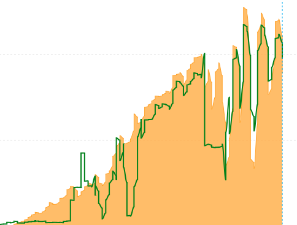
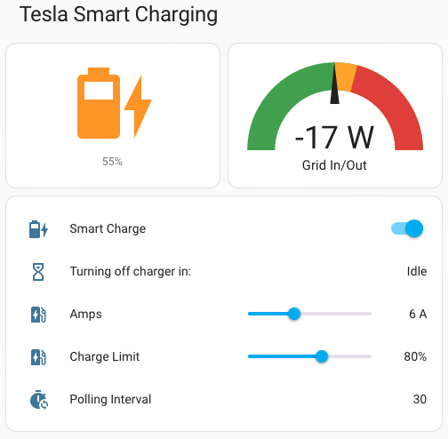

# Tesla Smart Charging using Solar for Home Assistant

A set of automations that will adjust the charge rate of a Tesla car to closely match the available solar being produced.



## Prerequisites

* You must have the [Tesla Home Assistant](https://github.com/alandtse/tesla) integration installed and working.
  
  This may require you to install the [Tesla HTTP Proxy](https://github.com/llamafilm/tesla-http-proxy-addon), but unless you can use Home Assistant to turn your charger on and off, this automation will not work.

* Have a sensor that monitors excess solar.
	
  I personally use a `Shelly 3EM` but you can also use your solar router if it proves the necessary data. You may have to create a helper sensor that gives the figure required.
  
  The automation relies on 1 sensor that provides how many watts of energy is either being exported or imported. The sensor must provide a negative figure when importing energy and a positive figure when there is spare energy being exported. If your figures are the opposite, you can use a template similar to this to reverse them:

```yml
power_in_or_out_reversed:
  friendly_name: "Shelly Live Power In/Out (Reversed)"
  unit_of_measurement: 'W'
  value_template: "{{ states('sensor.power_in_or_out') | float * -1 }}"
```

## Installation

1. You must perform a Find & Replace of the `charging.yaml` file to replace all occurances of `jess` with the name of your car, which you can find by looking at any of the entities of your car in the Home Assistant dashboard.

2. Search for and set these variables within the `charging.yaml` file under the `variables` section:
  * `min_charging_amps` Charger will turn off if the calculated charge rate is below this number of `Amps`.
  * `minimum_start_amps` Charging will not start until there is this many `Amps` availabe to charge.
  * `grid_voltage` I have 3-phase at 230-240v. If you only have single phase to your charger, remove ` * 3`. If you have a different voltage, change it here also. As solar can make the voltage fluctuate slightly, you want to use a figure toward the higher end of what might be available.

3. Either call your power sensor `sensor.power_in_or_out_reversed` or search and replace all instances of this within `charging.yaml` with the name of your sensor.

4. Copy the `charging.yaml` file to the `/homeassistant/packages/` folder. If you don't have a `packages` folder, then create one.

5. Edit your `configurations.yaml` file to add these lines:

```yml
homeassistant:
  packages:
    charging: !include packages/charging.yaml
```

6. Restart Home Assistant

## How it works

### Trigger

The automation is triggered every time the power sensor updates.

### Conditions

|Condition|Reason|
|:---|:---|
|10 seconds has elapsed|Rapid changes can cause weird things to happen because it takes time for the car to react to changes.|
|`input_boolean.smart_charge: on`|If you have disabled `Smart Charging` we don't want to interfere.|
|Car is plugged in|There's no point automating anything if the car is not plugged in.|
|Car is at home|You don't want automation turning your charger off when at a Supercharger!|

### Automations
|Condition|Action|
|:---|:---|
|Car is not charging.<br/>Number of spare `Amps` is above `minimum_start_amps`.<br/>Battery level is below the Charge level.|Cancel any timer that is going to turn the charger off.<br/>Set the charging amps to the number of amps available.<br/>Tell the car to start charging.|
|Car is currently charging.<br/>There are spare `Amps` available.<br/>The current charge rate is lower than the `max_charging_amps`.|Cancel any timer that is going to turn the charger off.<br/>Adjust the charge rate up.|
|Car is currently charging.<br/>There is not enough energy to charge at `min_charging_amps`.|Reduce the charge rate to `min_charging_amps`.<br/>Start the timer to turn the charger off in 2 minutes if it isn't already running.|
|Car is currently charging.<br/>Charge rate is too high.|Cancel any timer that is going to turn the charger off.<br/>Adjust the charge rate down.|
|default|Do nothing.|

## Additional Triggers

* There is a master switch to enable/disable smart charging called `input_boolean.smart_charge`. If you want to force charge your car, make sure you turn this toggle off.

* When you plug your car in, an automation will turn off the charger after 1 minute. If there is excess solar, that part of the automation will take over and asjust the charge rate accordingly. **Note:** Depending on the `polling_interval` you have set, it could take some time before this automation see's that you have connected the car. See [Polling](#polling) below.

* At sunset, smart charging is automatically disabled. This allows any scheduled Tesla charging to run at night.

## Notifications

There are some pre-defined notifications which you can disable by deleting the relevant section from the `charging.yaml` file.

* When you plug your car in but `Smart Charging` is disabled.

* Any time through the day that excess solar production is above 750w for 5 minutes and `Smart Charging` is disabled.

## Polling

At certain times, it's a good idea to reduce the polling interval of the Tesla API so this automation has the most up to date data from the car. I have added some additional polling automations in the `tesla_polling_automations.yaml` file which you can import to Home Assistant using the same method above.

## Views



Here's the `yaml` code to achieve the above view:

```yml
type: vertical-stack
title: Tesla Smart Charging
cards:
  - type: horizontal-stack
    cards:
      - show_name: false
        show_icon: true
        type: button
        name: Refresh Tesla Status
        show_state: true
        entity: sensor.jess_battery
      - type: gauge
        entity: sensor.power_in_or_out_rounded
        needle: true
        view_layout:
          position: sidebar
        min: -3000
        max: 3000
        severity:
          green: -3000
          yellow: 0
          red: 500
        unit: W
        name: Grid In/Out
  - type: entities
    entities:
      - entity: input_boolean.smart_charge
        name: Smart Charge
      - entity: timer.turn_off_car_charger
        name: 'Turning off charger in:'
      - entity: number.jess_charging_amps
        name: Amps
      - entity: number.jess_charge_limit
        name: Charge Limit
      - entity: sensor.jess_polling_interval
        name: Polling Interval

```